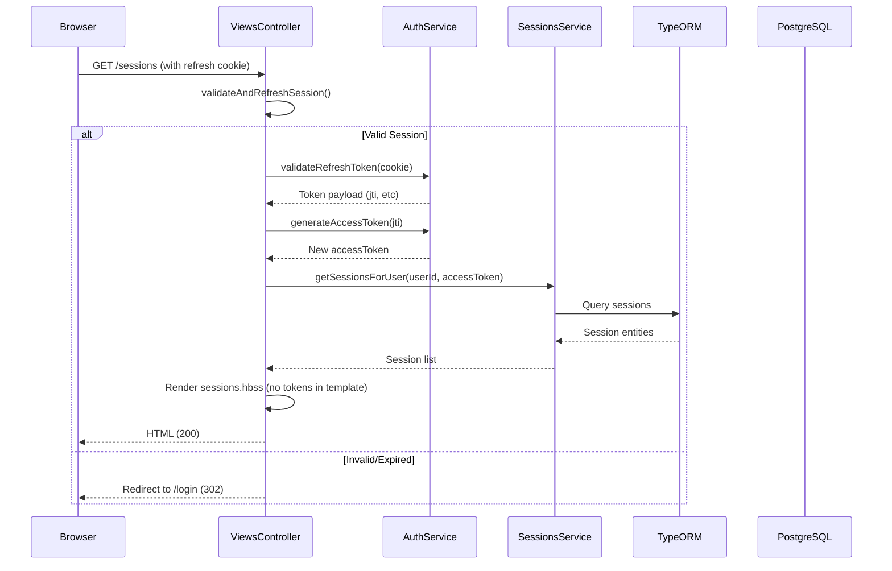
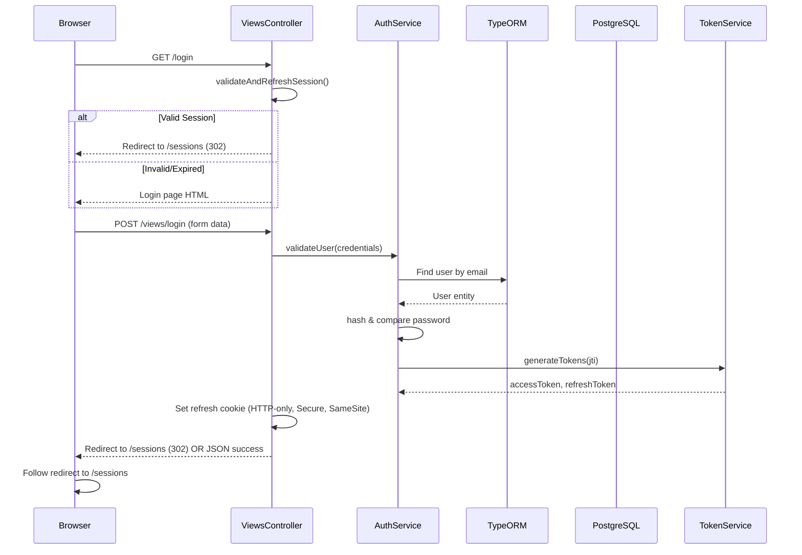
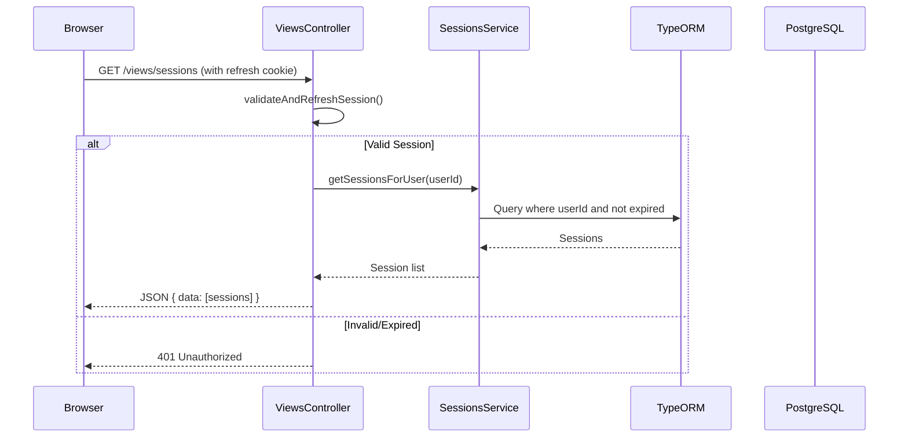
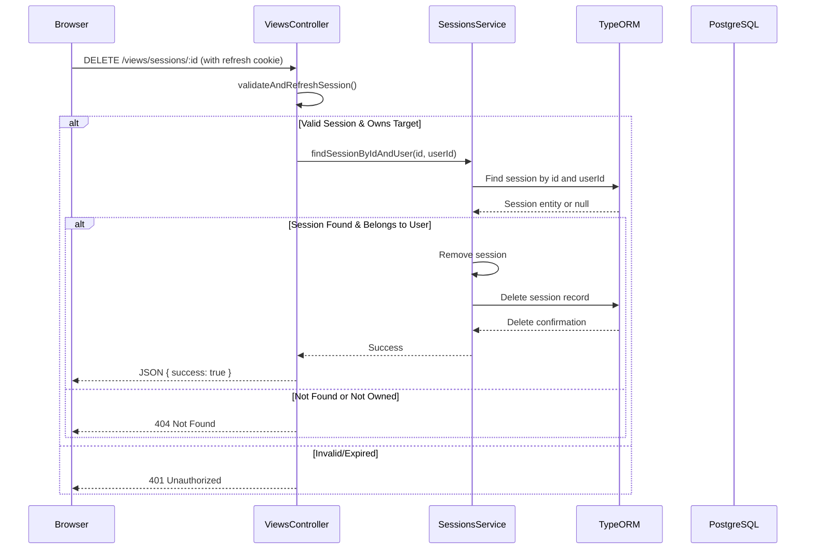

# Login, Register, and Sessions Pages Design

**Date:** 2026-09-10  
**Status:** Approved  
**Related Issue:** N/A

## Table of Contents
1. [Introduction](#introduction)
2. [Goals and Non-Goals](#goals-and-non-goals)
3. [Approach Overview](#approach-overview)
4. [Architecture](#architecture)
5. [Components](#components)
6. [Data Flow](#data-flow)
7. [Auth State Management](#auth-state-management)
8. [Styling with Tailwind CSS](#styling-with-tailwind-css)
9. [Testing Strategy](#testing-strategy)
10. [Dependencies](#dependencies)
11. [File Structure](#file-structure)
12. [Open Questions](#open-questions)
13. [Acceptance Criteria](#acceptance-criteria)

---

## Introduction
This document describes the implementation of server-rendered login, register, and sessions pages for the micro-auth-nestjs NestJS application. The pages will use Handlebars templating and Tailwind CSS for styling.

The implementation addresses the requirement to keep access tokens secure while providing a seamless user experience. Instead of exposing tokens to the frontend, we use a Backend-for-Frontend (BFF) pattern where ViewControllers handle all authentication logic and proxy requests to the existing auth/sessions services.

## Goals and Non-Goals

### Goals
- Provide server-rendered HTML pages for:
  - User login (`/login`)
  - User registration (`/register`)
  - Active sessions management (`/sessions`)
- Use Handlebars as the templating engine
- Style pages with Tailwind CSS
- Keep all token handling server-side (access tokens never exposed to frontend)
- Leverage existing HTTP-only refresh token cookie for server-side access token renewal
- Ensure secure token handling and CSRF protection where applicable
- Follow existing NestJS patterns and conventions
- Provide responsive, accessible UI
- Minimize attack surface by keeping tokens out of HTML/JavaScript where possible

### Non-Goals
- Creating a single-page application (SPA) framework
- Modifying existing authentication API contracts
- Implementing social login providers (OAuth, etc.)
- Adding multi-factor authentication (MFA)
- Changing the refresh token storage mechanism
- Building an admin dashboard (focus is on user-facing auth pages)
- Exposing access tokens to client-side JavaScript

## Approach Overview
We will extend the NestJS backend to serve server-rendered pages using the `@nestjs/platform-express` Handlebars adapter with a BFF (Backend-for-Frontend) pattern:

1. **View Controllers as BFF**: New controllers (`ViewsController`) handle:
   - GET requests for `/login`, `/register`, `/sessions` (page rendering)
   - All API routes needed by the frontend (e.g., `/views/sessions`, `/views/login`, etc.)
   - These controllers internally validate refresh tokens and obtain access tokens as needed

2. **Server-Side Token Management**: On each relevant request, the ViewController:
   - Checks for the refresh token HTTP-only cookie
   - Validates it via the existing auth service (internal call)
   - Obtains/refreshes access token if valid
   - Uses this access token to make internal calls to auth/sessions services
   - Never exposes tokens to the frontend

3. **Frontend Communication**: 
   - All frontend interactions (form submissions, data fetching) go to ViewController routes
   - ViewController proxies to existing auth/services after validating session via refresh token cookie
   - Frontend never handles tokens directly - all auth state managed via HTTP-only cookies and server-side sessions

4. **Form Handling**: 
   - Login/register forms POST to ViewController routes (e.g., `/views/login`)
   - ViewController validates, calls auth service, sets refresh token cookie
   - Sessions management: ViewController routes handle listing/revoke operations

This approach ensures:
- Zero token exposure to frontend (eliminates XSS risk via token theft)
- Refresh token remains in secure HTTP-only cookie
- Server handles all token validation and renewal
- Frontend interacts only with ViewController routes (same-origin, cookie-based)
- Leverages existing proven auth logic with minimal changes

## Architecture
```mermaid
flowchart TD
    %% External Entities
    Browser[Web Browser] -->|Requests| VC[View Controllers (BFF)]
    
    %% View Controllers Layer (BFF)
    subgraph VC[View Controllers (BFF)]
        VCLogin[Login Controller<br/>GET /login, POST /views/login]
        VCRegister[Register Controller<br/>GET /register, POST /views/register]
        VCSessions[Sessions Controller<br/>GET /sessions, GET /views/sessions, DELETE /views/sessions/:id]
    end
    
    %% Services Layer
    subgraph Services[Application Services]
        AuthService[Auth Service]
        SessionsService[Sessions Service]
        TokenService[Token Service]
        ViewService[View Service<br/>Template & Token Handling]
    end
    
    %% Infrastructure Layer
    subgraph Infrastructure[Infrastructure]
        TypeORM[TypeORM]
        PostgreSQL[(PostgreSQL Database)]
    end
    
    %% Connections
    VC -->|Internal service calls| Services
    VC -->|View rendering & token handling| ViewService
    Services -->|Data access| Infrastructure
    Infrastructure -->|Queries/Commands| TypeORM
    TypeORM -->|SQL| PostgreSQL
    
    %% Styling
    Browser -->|CSS/JS Requests| VC
    VC -->|Serves assets| Browser
    
    classDef external fill:#f9f,stroke:#333;
    classDef nestjs fill:#bbf,stroke:#333;
    classDef service fill:#bfb,stroke:#333;
    classDef infra fill:#fbb,stroke:#333;
    classDef storage fill:#ff9,stroke:#333;
    
    class Browser external;
    class VC nestjs;
    class Services service;
    class TypeORM infra;
    class PostgreSQL storage;
```

### Layers
1. **Presentation Layer**: Handlebars templates + Tailwind CSS (served by ViewControllers)
2. **View Controllers Layer (BFF)**: 
   - Handles page rendering and API endpoints
   - Manages refresh token validation and access token renewal
   - Proxies to internal services after validation
3. **Application Layer**: Existing AuthService, SessionsService, TokenService
4. **Infrastructure Layer**: TypeORM, PostgreSQL, JWT, bcrypt
5. **Storage Layer**: PostgreSQL database

### Key Interactions
- Browser → GET `/login` → ViewControllers.login() → validates session → if authenticated redirect to `/sessions` else renders login.hbs
- Browser → POST `/views/login` → ViewControllers.loginAPI() → validates via AuthService → sets refresh cookie
- Browser → GET `/sessions` → ViewControllers.sessionsPage() → validates refresh cookie → gets access token → calls SessionsService → renders sessions.hbs
- Browser → GET `/views/sessions` → ViewControllers.sessionsAPI() → validates refresh cookie → gets access token → calls SessionsService → returns JSON
- Browser → DELETE `/views/sessions/:id` → ViewControllers.revokeSession() → validates → calls SessionsService → returns success

## Components

### 1. View Controllers (`src/views/views.controller.ts`)
- **Page Rendering Routes**:
  - `GET /login` - Renders login page (redirects to `/sessions` if already authenticated)
  - `GET /register` - Renders register page  
  - `GET /sessions` - Renders sessions page (requires valid session)
  
- **API Routes (BFF)**:
  - `POST /views/login` - Handles login form submission
  - `POST /views/register` - Handles registration form submission
  - `GET /views/sessions` - Returns user's active sessions (JSON)
  - `DELETE /views/sessions/:id` - Revokes specific session
  - `DELETE /views/sessions` - Revokes all sessions except current

- **Internal Helper Methods**:
  - `validateAndRefreshSession()` - Extracts refresh token cookie, validates, gets fresh access token
  - `requireAuth()` - Ensures valid session, redirects to login if invalid
  - Service call wrappers for AuthService, SessionsService

### 2. Views Service (`src/views/views.service.ts`)
- Encapsulates logic for:
  - Validating refresh token from request cookies
  - Requesting new access token from AuthService
  - Error handling (token invalid/expired → redirect to login)
  - Preparing data for templates (user info, session list, etc.)
  - Template rendering utilities

### 3. Handlebars Templates (`src/views/`)
#### Layouts
- `src/views/layouts/base.hbs` - Base HTML structure with Tailwind CSS links, slots for content

#### Pages
- `src/views/pages/login.hbs` - Login form (posts to `/views/login`)
- `src/views/pages/register.hbs` - Registration form (posts to `/views/register`)  
- `src/views/pages/sessions.hbs` - Sessions list + revoke buttons (fetches from `/views/sessions`)

#### Partials
- `src/views/partials/header.hbs` - Navigation/header (shows user info, nav links)
- `src/views/partials/footer.hbs` - Footer
- `src/views/partials/auth-form.hbs` - Reusable form fields with validation
- `src/views/partials/session-item.hbs` - Individual session display (with revoke button)

### 4. Static Assets & Client Logic
- `src/views/assets/css/tailwind.css` - Custom Tailwind configuration
- `src/views/assets/js/main.js` - Client-side logic:
  - Handle form submissions (via fetch to `/views/*` endpoints)
  - Handle session revocation (DELETE to `/views/sessions/:id`)
  - Show loading states, error messages, success notifications
  - No token handling - all auth managed via cookies
- Assets: `src/views/assets/` - Images, icons, etc.

## Data Flow

### Page Render Flow (GET /sessions example)


### Form Submission Flow (Login via BFF)


### API Call Flow (After Login - BFF Pattern)


### Session Revocation Flow


## Auth State Management

### Server-Side (ViewController Level)
1. **Session Validation**: 
   - Extract refresh token from `request.cookies['Refresh']` (name from config)
   - Call `authService.validateRefreshToken(token)` - returns payload if valid
   - If invalid/expired: return 401 or redirect to `/login` for page routes

2. **Access Token Renewal** (when needed for internal service calls):
   - If valid refresh token: call `authService.generateAccessToken(payload.jti)` 
   - Use this access token to call internal AuthService/SessionsService methods
   - Access token lives only for the duration of the request handling

3. **Stateless Operation**:
   - No server-side sessions stored
   - All state maintained via refresh token cookie + short-lived access tokens in memory
   - Each request independently validates and potentially renews tokens

### Client-Side (Zero Token Exposure)
1. **No tokens in DOM**: Templates contain zero access token references
2. **Cookie-based auth**: Frontend makes requests to ViewController routes (`/views/*`)
   - Browser automatically sends refresh token cookie with same-origin requests
   - No need for Authorization headers or token storage in JS
3. **Simple frontend logic**:
   ```javascript
   // Example: Fetching sessions
   const response = await fetch('/views/sessions', {
     method: 'GET',
     credentials: 'include' // Important: sends cookies
   });
   
   // Example: Revoking session
   await fetch(`/views/sessions/${sessionId}`, {
     method: 'DELETE',
     credentials: 'include'
   });
   ```
4. **Form handling**: Uses standard form submissions or fetch with credentials: 'include'

### Security Benefits of This Approach
- **Zero Token Exposure**: 
  - Access tokens never touch frontend (not in JS, DOM, cookies, storage)
  - Eliminates XSS attack vector for token theft
- **Refresh Token Protection**:
  - HTTP-only cookie (not accessible via JavaScript)
  - Secure flag in production (HTTPS only)
  - SameSite=Strict/Lax (CSRF protection)
  - Long-lived but access tokens are short-lived (limits damage if stolen)
- **CSRF Mitigation**:
  - SameSite cookies provide inherent CSRF protection for same-origin requests
  - For extra safety, can implement double-submit cookie or custom header checks
- **Reduced Attack Surface**:
  - No token handling logic in frontend JavaScript
  - All auth complexity contained in secure backend ViewControllers
  - Frontend only handles UI state and user interactions

### Additional Security Considerations
- **Content Security Policy**: Implement strict CSP headers to prevent XSS
- **Rate Limiting**: Apply to login/register endpoints to prevent brute force
- **Input Validation**: All form inputs validated via DTOs and validation pipes
- **Output Encoding**: Handlebars auto-escapes by default; use `{{{ }}}` only for trusted HTML
- **Session Fixation**: Regenerate session identifiers on login (handled by JWT jti)

## Styling with Tailwind CSS
- Install Tailwind CSS v4 via PostCSS
- Configure `tailwind.config.js` with content paths including `src/views/**/*.hbs`
- Use `@tailwind base; @tailwind components; @tailwind utilities;` in CSS file
- Build process: `tailwindcss -i ./src/views/assets/css/input.css -o ./src/views/assets/css/output.css --watch`
- Reference compiled CSS in base.hbs layout
- Utilize Tailwind's responsive prefixes (sm:, md:, lg:, xl:)
- Follow accessibility guidelines (focus states, aria labels, semantic HTML)
- Extract colors, spacing, etc. to Tailwind config for consistency

## Testing Strategy

### Unit Tests
- `ViewsController`:
  - Test redirect when no/invalid refresh cookie (page routes)
  - Test successful render with valid cookie
  - Test API routes return 401 for invalid/missing session
  - Test token renewal calls AuthService correctly for internal service calls
  - Test form submission handling (validation, success, error cases)
- `ViewsService`:
  - Test token validation logic
  - Test error handling (redirects, error responses)
  - Test template data preparation
- Template rendering: smoke test that templates compile without errors

### Integration Tests
- Test full render flow: GET `/login` returns 200 with login form (or redirect if authenticated)
- Test GET `/sessions` redirects to login when no/invalid cookie
- Test GET `/sessions` returns 200 with session list when valid session
- Test POST `/views/login` works with valid credentials and sets cookie
- Test POST `/views/register` creates user and logs in
- Test GET `/views/sessions` returns session data for authenticated requests
- Test DELETE `/views/sessions/:id` revokes specific session
- Test DELETE `/views/sessions` revokes all except current

### E2E Tests (using Playwright or similar)
- User journey: 
  1. Visit `/login` → submit valid credentials → redirected to `/sessions`
  2. Verify login successful (no tokens in localStorage/document.cookie)
  3. Verify sessions page loads and shows user's sessions
  4. Test revoking a session removes it from list
  5. Test token expiration handling (access expired but refresh valid → silent renewal)
  6. Test accessing `/sessions` after refresh shows fresh data (server-side renewal)
  7. Test accessing `/sessions` after logout/token expiry redirects to login
  8. Test CSRF protection (if implemented)
  9. Test responsive design breakpoints

### Manual Testing Checklist
- [ ] Login page loads with Tailwind styling
- [ ] Valid login creates session, redirects to sessions page
- [ ] Invalid login shows appropriate error
- [ ] Registration page works (validation, duplicate email, etc.)
- [ ] Sessions page lists current sessions with relevant info (IP, device, time)
- [ ] Revoke session button works and removes session from list
- [ ] Revoke all sessions (except current) works
- [ ] No access token found in document.cookie, localStorage, sessionStorage
- [ ] Refresh token present in HTTP-only cookie (inspectable via dev tools)
- [ ] Pages render correctly after refresh (token renewed server-side)
- [ ] Access token never appears in HTML/network requests (view-source, dev tools)
- [ ] Responsive design on mobile/tablet/desktop
- [ ] Accessibility: tab order, labels, contrast, screen reader friendly
- [ ] Error handling: 404, 500 pages styled appropriately
- [ ] Network tab shows requests to `/views/*` endpoints with cookies

## Dependencies

### New NPM Packages
```json
{
  "dependencies": {
    "@nestjs/platform-express": "^11.0.0", // likely already present
    "handlebars": "^4.7.8",
    "tailwindcss": "^4.0.0",
    "postcss": "^8.4.0",
    "autoprefixer": "^10.4.0"
  },
  "devDependencies": {
    "tailwindcss": "^4.0.0",
    "postcss": "^8.4.0",
    "autoprefixer": "^10.4.0"
  }
}
```

### Optional Dev Dependencies for Testing
```json
{
  "devDependencies": {
    "@types/handlebars": "^4.1.0",
    "@playwright/test": "^1.40.0"
  }
}
```

## File Structure
```
src/
├── views/
│   ├── controllers/
│   │   └── views.controller.ts
│   ├── services/
│   │   └── views.service.ts
│   ├── assets/
│   │   ├── css/
│   │   │   ├── input.css          # Tailwind source
│   │   │   └── output.css         # Compiled Tailwind
│   │   └── js/
│   │       └── main.js            # Client-side UI logic (no auth)
│   ├── layouts/
│   │   └── base.hbs
│   ├── pages/
│   │   ├── login.hbs
│   │   ├── register.hbs
│   │   └── sessions.hbs
│   └── partials/
│       ├── header.hbs
│       ├── footer.hbs
│       ├── auth-form.hbs
│       └── session-item.hbs
├── auth/                          # unchanged (existing)
├── sessions/                      # unchanged (existing)
├── common/                        # unchanged
├── config/                        # unchanged
├── app.module.ts                  # add ViewsModule import
└── main.ts                        # add view engine setup
```

### Required Changes to Existing Files
1. `src/main.ts`:
   - Add Handlebars view engine configuration
   - Set views directory
   - Configure static asset serving for views/assets
2. `src/app.module.ts`:
   - Import and register `ViewsModule`
3. `src/views/views.module.ts`:
   - Define module with controllers, services
4. `.gitignore`:
   - Add `src/views/assets/css/output.css` (compiled CSS)
   - Add `node_modules/`, `dist/`, etc. as usual

## Open Questions
1. **Cookie Name**: What is the exact name of the refresh token cookie? (Check `src/auth/AGENTS.md` - likely 'Refresh' from NestJS JWT defaults)
2. **Token Lifetime**: What are the access token and refresh token expiration times configured? (Needed for understanding security windows)
3. **Base URL**: Will the app be served from root (`/`) or a subpath? (Affects form actions and asset paths)
4. **CSRF Protection**: Should we implement additional CSRF protection beyond SameSite cookies? (e.g., double-submit cookie, custom headers)
5. **Error Pages**: Should we create custom error pages (404, 500) using same templating?
6. **Internationalization**: Is i18n required for these pages?
7. **Rate Limiting**: What rate limits should apply to login/register endpoints?
8. **Assets Location**: Should we serve static assets (images, icons) from `src/views/assets/` or use a public directory?
9. **Session Info**: What session information should be displayed in the sessions page? (IP, user agent, timestamp, etc.)

## Acceptance Criteria
- [ ] User can navigate to `/login` and see a styled login form (or be redirected to `/sessions` if already authenticated)
- [ ] User can submit valid credentials and be redirected to `/sessions`
- [ ] **Zero access tokens exposed**: None found in HTML, JS variables, localStorage, sessionStorage, or cookies
- [ ] Refresh token present in HTTP-only cookie after login (Secure, SameSite flags)
- [ ] `/sessions` page loads and displays user's active sessions
- [ ] User can revoke individual sessions via button (calls `/views/sessions/:id`)
- [ ] User can revoke all other sessions via button (calls `/views/sessions`)
- [ ] Page refresh maintains authenticated state (server-side token renewal)
- [ ] Accessing `/sessions` without valid session redirects to `/login`
- [ ] Tailwind CSS is applied and responsive
- [ ] No console errors related to missing tokens or failed API calls
- [ ] Network shows requests to `/views/*` endpoints with cookies, no Authorization headers
- [ ] Unit tests for ViewsController and ViewsService pass (≥80% coverage)
- [ ] E2E test of login → sessions → revoke flow passes
- [ ] Build process compiles Tailwind CSS without errors
- [ ] Security review: No token leakage in view-source or network tabs

---
*This design document follows the bounded path approach as we are adding new UI layers (ViewControllers, templates, assets) atop existing, stable APIs (AuthService, SessionsService). Implementation will proceed via normal development workflow after approval.*